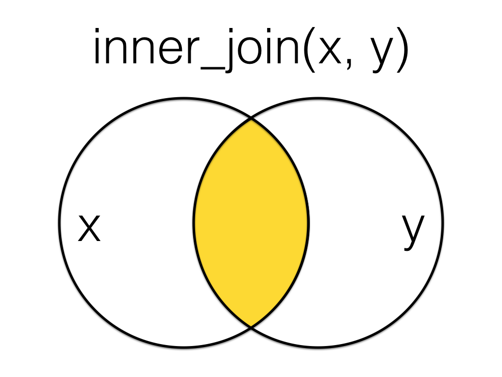
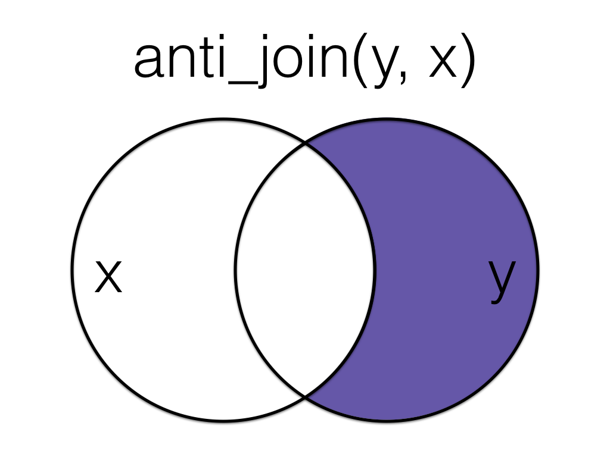

# Session 3.2 {#session-3-2}

```{r echo=FALSE, warning=FALSE, message=FALSE}
library(tidyverse)
```


## Set-up

Open your Workshop project and do the following:

* Create and save a new R Markdown document named Session 3.2. get rid of the default template text from line 11 onwards.
* Download the [Data transformation cheatsheet](https://raw.githubusercontent.com/rstudio/cheatsheets/main/data-transformation.pdf).
* Create a new code chunk and load the tidyverse.

## Loading data {#joins-data}

The data you want to report on or visualise are often in more than one file (or more than one tab of an excel file). You might need to join up participant demographic information with their experimental data, or score questionnaire responses according to a scoring ket.

For this demo, rather than loading in data, we'll create two small data tables from scratch using the `tibble()` function.

`customers` has id, city and postcode for five customers 1-5.

-   `1:5` will fill the variable `id` with all integers between 1 and 5.
-   `city` and `code` both use the `c()` function to enter multiple strings. Note that each entry is contained within its own quotation marks, apart from missing data, which is recorded as `NA`.
-   When entering data like this, it's important that the order of each variable matches up. So number 1 will correspond to "Port Ellen" and "PA42 7DU".

```{r subject}
customers <- tibble(
  id = 1:5,
  city = c("Port Ellen", "Dufftown", NA, "Aberlour", "Tobermory"),
  postcode = c("PA42 7DU", "AB55 4DH", NA, "AB38 7RY", "PA75 6NR")
)
```

`r kable(customers, caption="Demo customers table.")`

`orders` has customer id and the number of items ordered. Some customers from the previous table have no orders, some have more than one order, and some are not in the customer table.

```{r orders}
orders <- tibble(
  id = c(2, 3, 4, 4, 5, 5, 6, 6, 7),
  items = c(10, 18, 21, 23, 9, 11, 11, 12, 3)
)
```

`r kable(orders, caption="Demo orders table.")`

## Mutating Joins

`r glossary("Mutating joins")` act like the `r hl(dplyr::mutate())` function in that they add new columns to one table based on values in another table. 

All the mutating joins have this basic syntax:

`****_join(x, y, by = NULL, suffix = c(".x", ".y"))`

-   `x` = the first (left) table
-   `y` = the second (right) table
-   `by` = what columns to match on. If you leave this blank, it will match on all columns with the same names in the two tables.
-   `suffix` = if columns have the same name in the two tables, but you aren't joining by them, they get a suffix to make them unambiguous. This defaults to ".x" and ".y", but you can change it to something more meaningful.

::: {.info data-latex=""}
You can leave out the `by` argument if you're matching on all of the columns with the same name, but it's good practice to always specify it so your code is robust to changes in the loaded data.
:::

### left_join() {#left_join}

::: join

:::

A `left_join` keeps all the data from the first (left) table and adds anything that matches from the second (right) table. If the right table has more than one match for a row in the left table, there will be more than one row in the joined table (see ids 4 and 5).

```{r left_join}
left_data <- left_join(customers, orders, by = "id")
left_data
```

::: join

:::

The order you specify the tables matters, in the below code we have reversed the order and so the result is all rows from the `orders` table joined to any matching rows from the `customers` table.

```{r left_join-2}
left2_data <- left_join(orders, customers, by = "id")
left2_data
```

### right_join() {#right_join}

::: join

:::

A `right_join` keeps all the data from the second (right) table and joins anything that matches from the first (left) table.

```{r right_join}
right_data <- right_join(customers, orders, by = "id")
right_data
```

::: {.info data-latex=""}
This table has the same information as `left_join(orders, customers, by = "id")`, but the columns are in a different order (left table, then right table).
:::

### inner_join() {#inner_join}

::: join

:::

An `inner_join` returns all the rows that have a match in both tables. Changing the order of the tables will change the order of the columns, but not which rows are kept.

```{r inner_join}
inner_data <- inner_join(customers, orders, by = "id")
inner_data
```

### full_join() {#full_join}

::: join

:::

A `full_join` lets you join up rows in two tables while keeping all of the information from both tables. If a row doesn't have a match in the other table, the other table's column values are set to `NA`.

```{r full_join}
full_data <- full_join(customers, orders, by = "id")
full_data
```

## Filtering Joins

`r glossary("Filtering joins")` act like the `dplyr::filter()` function in that they keep and remove rows from the data in one table based on the values in another table. The result of a filtering join will only contain rows from the left table and have the same number or fewer rows than the left table. 

### semi_join() {#semi_join}

::: join

:::

A `semi_join` returns all rows from the left table where there are matching values in the right table, keeping just columns from the left table.

```{r semi_join}
semi_data <- semi_join(customers, orders, by = "id")
semi_data
```

::: {.info data-latex=""}
Unlike an inner join, a semi join will never duplicate the rows in the left table if there is more than one matching row in the right table.
:::

::: join

:::

Order matters in a semi join.

```{r semi_join-2}
semi2_data <- semi_join(orders, customers, by = "id")
semi2_data
```

### anti_join() {#anti_join}

::: join

:::

An `anti_join` return all rows from the left table where there are *not* matching values in the right table, keeping just columns from the left table.

```{r anti_join}
anti_data <- anti_join(customers, orders, by = "id")
anti_data
```

::: join

:::

Order matters in an anti join.

```{r anti_join-2}
anti2_data <- anti_join(orders, customers, by = "id")
anti2_data
```

## Multiple joins

The `****_join()` functions are all **two-table verbs**, that is, you can only join together two tables at a time. However, you may often need to join together multiple tables. To do so, you simply need to add on additional joins. You can do this by creating an intermediate object or more efficiently by using a pipe.

```{r}
# create a table of overall customer satisfaction scores
satisfaction <- tibble(
  id = 1:5,
  satisfaction = c(4, 3, 2, 3, 1)
)

# perform the initial join
join_1 <- left_join(customers, orders, by = "id")

# perform the second join on the new object
join_2 <- left_join(join_1, satisfaction, 
                    by = "id")
```


```{r}
# more efficient method using the pipe
pipe_join <- customers %>%
  left_join(orders, by = "id") %>%
  left_join(satisfaction, by = "id")

```

::: {.warning data-latex=""}
At every stage of any analysis you should **check your output** to ensure that what you created is what you intended to create, but this is particularly true of joins. You should be familiar enough with your data through routine checks using functions like `glimpse()`, `str()`, and `summary()` to have a rough idea of what the join should result in. At the very least, you should know whether the joined object should result in more or fewer variables and observations.

If you have a multi-line join like in the above piped example, build up the code and check the output at each stage.
:::


## Binding Joins

`r glossary("Binding joins")` bind one table to another by adding their rows or columns together.

### bind_rows() {#bind_rows}

You can combine the rows of two tables with `bind_rows`.

Here we'll add customer data for customers 6-9 and bind that to the original customer table.

```{r bind_rows}
new_customers <- tibble(
  id = 6:9,
  city = c("Falkirk", "Ardbeg", "Doogal", "Kirkwall"),
  postcode = c("FK1 4RS", "PA42 7EA", "G81 4SJ", "KW15 1SE")
)

bindr_data <- bind_rows(customers, new_customers)
bindr_data
```

The columns just have to have the same names, they don't have to be in the same order. Any columns that differ between the two tables will just have `NA` values for entries from the other table.

If a row is duplicated between the two tables (like id 5 below), the row will also be duplicated in the resulting table. If your tables have the exact same columns, you can use `union()` (see Section\ \@ref(union)) to avoid duplicates.

```{r bind-rows-union}
new_customers <- tibble(
  id = 5:9,
  postcode = c("PA75 6NR", "FK1 4RS", "PA42 7EA", "G81 4SJ", "KW15 1SE"),
  city = c("Tobermory", "Falkirk", "Ardbeg", "Doogal", "Kirkwall"),
  new = c(1,2,3,4,5)
)

bindr2_data <- bind_rows(customers, new_customers)
bindr2_data
```

### bind_cols() {#bind_cols}

You can merge two tables with the same number of rows using `bind_cols`. This is only useful if the two tables have the same number of rows in the exact same order.

```{r bind_cols}
new_info <- tibble(
  colour = c("red", "orange", "yellow", "green", "blue")
)

bindc_data <- bind_cols(customers, new_info)
bindc_data 
```

::: {.info data-latex=""}
The only advantage of `bind_cols()` over a mutating join is when the tables don't have any IDs to join by and you have to rely solely on their order. Otherwise, you should use a mutating join (all four mutating joins result in the same output when all rows in each table have exactly one match in the other table).
:::

## Set Operations

`r glossary("Set operations")` compare two tables and return rows that match (intersect), are in either table (union), or are in one table but not the other (setdiff).

### intersect() {#intersect}

`dplyr::intersect()` returns all rows in two tables that match exactly. The columns don't have to be in the same order, but they have to have the same names.

```{r intersect}
new_customers <- tibble(
  id = 5:9,
  postcode = c("PA75 6NR", "FK1 4RS", "PA42 7EA", "G81 4SJ", "KW15 1SE"),
  city = c("Tobermory", "Falkirk", "Ardbeg", "Doogal", "Kirkwall")
)

intersect_data <- intersect(customers, new_customers)
intersect_data
```

::: {.warning data-latex=""}
If you've forgotten to load dplyr or the tidyverse, `r glossary("base R")` also has a `base::intersect()` function that doesn't work like `dplyr::intersect()`. The error message can be confusing and looks something like this:

```{r base-intersect, error = TRUE}
base::intersect(customers, new_customers)
```
:::

### union() {#union}

`dplyr::union()` returns all the rows from both tables, removing duplicate rows, unlike `bind_rows()`.

```{r union}
union_data <- union(customers, new_customers)
union_data
```

::: {.warning data-latex=""}
If you've forgotten to load dplyr or the tidyverse, `r glossary("base R")` also has a `base::union()` function. You usually won't get an error message, but the output won't be what you expect.

```{r base-union}
base::union(customers, new_customers)
```
:::

### setdiff() {#setdiff}

`dplyr::setdiff` returns rows that are in the first table, but not in the second table.

```{r setdiff}
setdiff_data <- setdiff(customers, new_customers)
setdiff_data
```

Order matters for `setdiff`.

```{r setdiff-order}
setdiff2_data <- setdiff(new_customers, customers)
setdiff2_data
```

::: {.warning data-latex=""}
If you've forgotten to load dplyr or the tidyverse, `r glossary("base R")` also has a `base::setdiff()` function. You usually won't get an error message, but the output might not be what you expect because `base::setdiff()` expects columns to be in the same order, so id 5 here registers as different between the two tables.

```{r base-setdiff}
base::setdiff(customers, new_customers)
```
:::

## Conflicting variable types

When you import or create data, R will do its best to set each column to an appropriate data type. However, sometimes it gets it wrong or sometimes there's something in the way the data has been encoded in the original spreadsheet that causes the data type to be different than expected. When joining datasets by common columns, it's important that not only are the variable names identical, but the data type of those variables is identical.

Let's recreate our `new_customers` dataset but this time, we'll specify that `id` is a `r glossary("character")` variable.

```{r}
new_customers2 <- tibble(
  id = as.character(5:9),
  postcode = c("PA75 6NR", "FK1 4RS", "PA42 7EA", "G81 4SJ", "KW15 1SE"),
  city = c("Tobermory", "Falkirk", "Ardbeg", "Doogal", "Kirkwall")
)
str(new_customers2)

```

If you try to join this dataset to any of the other datasets where `id` is stored as a `r glossary("numeric")` variable, it will produce an error. 

```{r error=TRUE}
inner_join(customers, new_customers2)
```

The same goes for `bind_rows()`:

```{r error=TRUE}
bind_rows(customers, new_customers2)
```


One method to change variable types is to use the `as.***` functions. If you type `as.` into a code chunk, you will see that there are a huge number of these functions for transforming variables and datasets to different types. Exactly which one you need will depend on the data you have, but a few commonly used ones are:

* `as.numeric()` - convert a variable to `r glossary("numeric")`. Useful for when you have a variable of real numbers that have been encoded as character. Any values that can't be turned into numbers (e.g., if you have the word "missing" in cells that you have no data for), will be returned as `NA`.
* `as.factor()` - convert a variable to a `r glossary("factor")`. You can set the factor levels and labels manually, or use the default order (alphabetical).
* `as.character()` - convert a variable to `r glossary("character")` data.
* `as.tibble()` and `as.data.frame()` - convert a list object (not a variable) to a tibble or a data frame (two different table formats). This isn't actually relevant to what we're discussing here, but it's a useful one to be aware of because sometimes you'll run into issues where you get an error that specifically requests your data is a tibble or data frame type and you can use this function to overwrite your object. 

To use these functions on a variable we can use `mutate()` to overwrite the variable with that variable as the new data type:

```{r}
new_customers2 <- new_customers2 %>%
  mutate(id = as.numeric(id))
```

Once you've done this, the joins will now work:

```{r}
inner_join(orders, new_customers2)
```

## Glossary {#glossary-3-2}

`r glossary_table()`

## Further resources {#resources-3-2}

* [Data transformation cheatsheet](https://raw.githubusercontent.com/rstudio/cheatsheets/main/data-transformation.pdf)
* [Chapter 13: Relational Data](http://r4ds.had.co.nz/relational-data.html) in *R for Data Science*