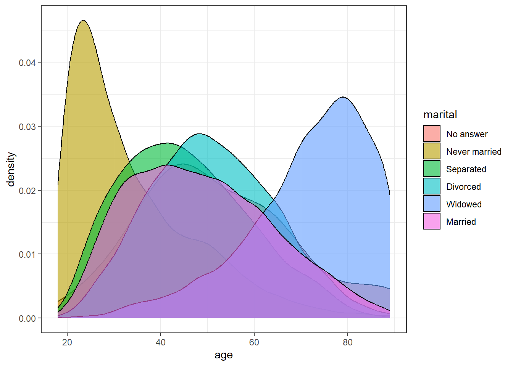
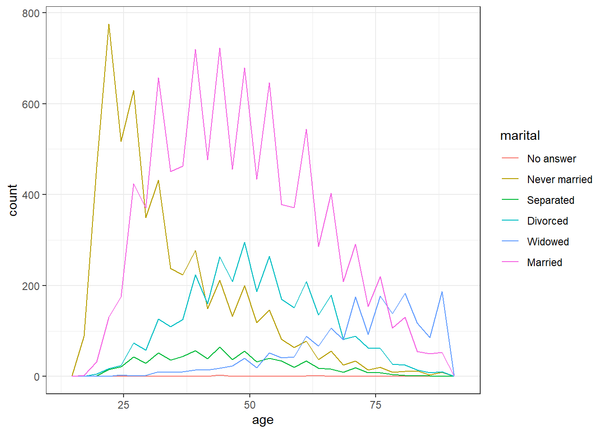
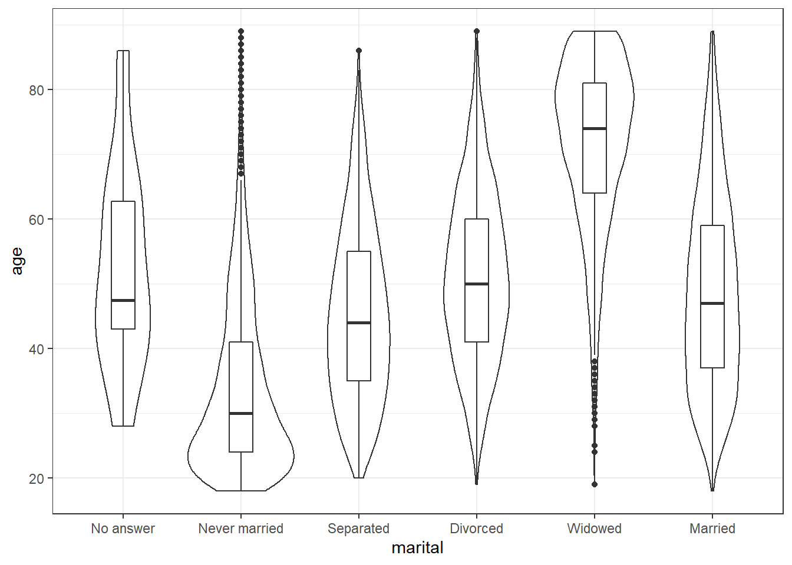

# Session 2.2 {#session-2-2}

## Exercises

To consolidate what you've learned so far, use the built-in `starwars` data set to create each of the following:

* A histogram of heights
* A scatterplot of height v mass with line of best fit
* A bar chart of counts for gender


<div class='webex-solution'><button>Solution</button>


```r
# load data
data("starwars")

# histogram
ggplot(starwars, aes(x = height)) +
  geom_histogram()
```

```
## `stat_bin()` using `bins = 30`. Pick better value with `binwidth`.
```

```
## Warning: Removed 6 rows containing non-finite values (stat_bin).
```


```r
# scatterplot
ggplot(starwars, aes(x = height, y = mass)) +
  geom_point() +
  geom_smooth()
```

```
## `geom_smooth()` using method = 'loess' and formula 'y ~ x'
```

```
## Warning: Removed 28 rows containing non-finite values (stat_smooth).
```

```
## Warning: Removed 28 rows containing missing values (geom_point).
```


```r
# bar chart
ggplot(starwars, aes(x = gender)) +
  geom_bar()
```


</div>


Then use the built-in`gss_cat` data set to create:

* A grouped density plot of age by marital status
* A frequency plot of age by marital status
* A violin-boxplot of age by marital status


<div class='webex-solution'><button>Solution</button>


```r
# load data
data("gss_cat")

# grouped density
ggplot(gss_cat, aes(x = age, fill = marital)) +
  geom_density(alpha = .6)
```

```
## Warning: Removed 76 rows containing non-finite values (stat_density).
```



```r
# frequency plot
ggplot(gss_cat, aes(x = age, colour = marital)) +
  geom_freqpoly()
```

```
## `stat_bin()` using `bins = 30`. Pick better value with `binwidth`.
```

```
## Warning: Removed 76 rows containing non-finite values (stat_bin).
```



```r
# violin-boxplot
ggplot(gss_cat, aes(x = marital, y = age)) +
  geom_violin() +
  geom_boxplot(width = .2)
```

```
## Warning: Removed 76 rows containing non-finite values (stat_ydensity).
```

```
## Warning: Removed 76 rows containing non-finite values (stat_boxplot).
```




</div>


Finally, pick your two favourite plots from the above, spend some time adjusting the aesthetics (colours, themes, labels etc.), then combine them using <code class='package'>patchwork</code>. If you're on Twitter, share them with #PsyTeachR and tag [emilynordmann](https://twitter.com/emilynordmann).
