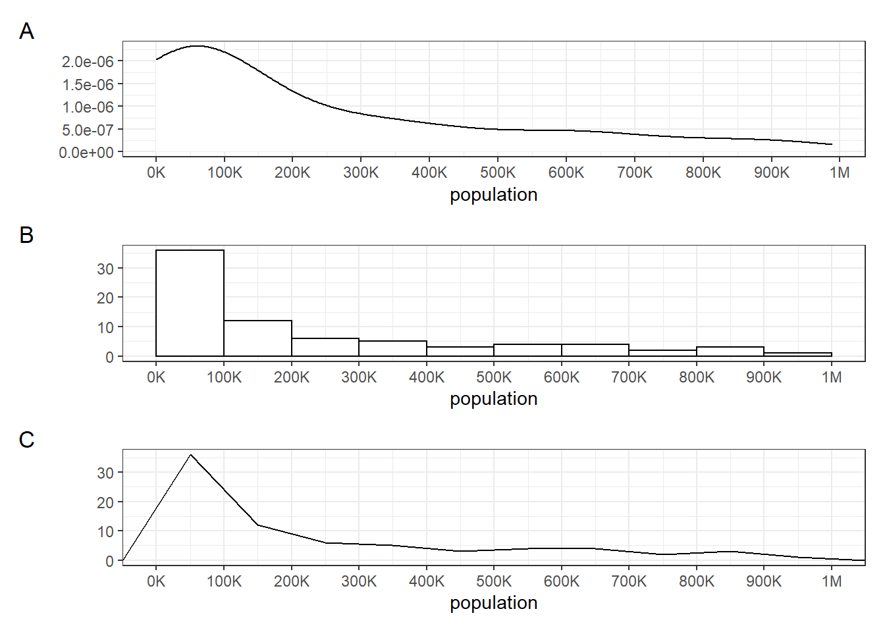
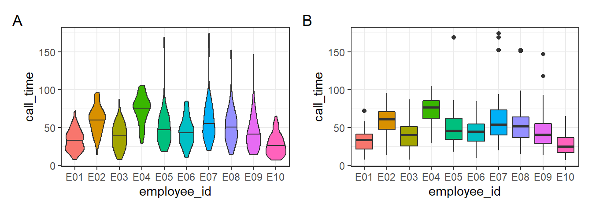
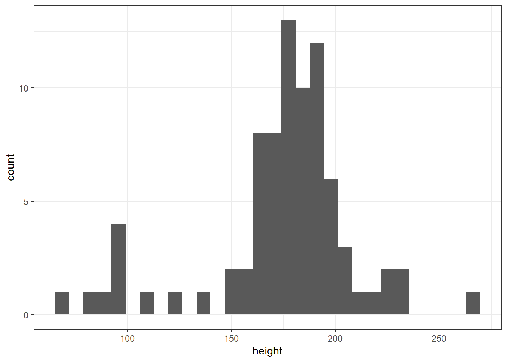
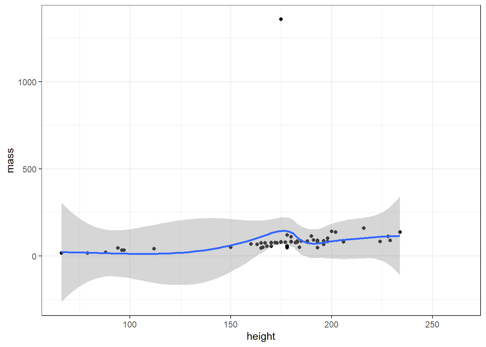
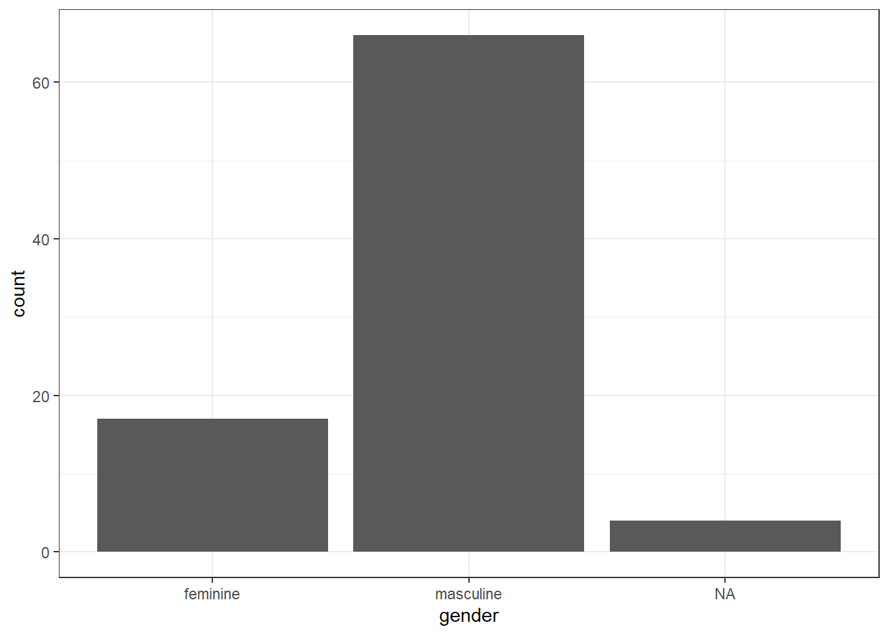
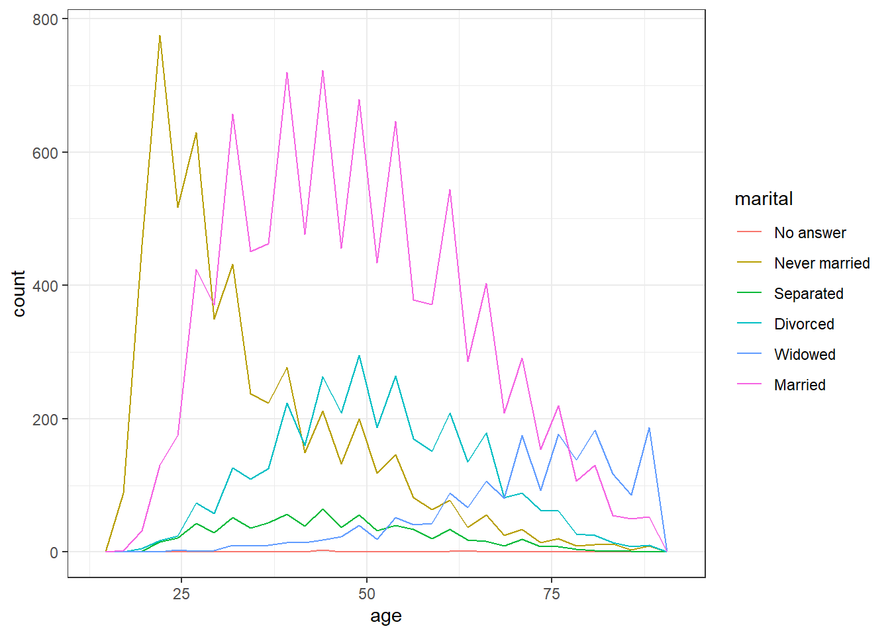

# Session 2.2 {#session-2-2}


## Test your understanding 1


Here is a small data table.

country             | population      | island
:-------------------|----------------:|:--------------
Northern Ireland    | 1,895,510       | Ireland
Wales               | 3,169,586       | Great Britain
Republic of Ireland | 4,937,786       | Ireland
Scotland            | 5,466,000       | Great Britain
England             | 56,550,138      | Great Britain

::: {.try data-latex=""}

* What geom would you use to plot the population for each of the 5 countries? <select class='webex-select'><option value='blank'></option><option value='x'>geom_bar</option><option value='answer'>geom_col</option></select>
* What mapping would you use?  <div class='webex-radiogroup' id='radio_OKUWHMFDOS'><label><input type="radio" autocomplete="off" name="radio_OKUWHMFDOS" value="answer"></input> <span>aes(x = country, y = population)</span></label><label><input type="radio" autocomplete="off" name="radio_OKUWHMFDOS" value="x"></input> <span>aes(x = population, y = country)</span></label><label><input type="radio" autocomplete="off" name="radio_OKUWHMFDOS" value="x"></input> <span>aes(x = country)</span></label><label><input type="radio" autocomplete="off" name="radio_OKUWHMFDOS" value="x"></input> <span>aes(x = island)</span></label><label><input type="radio" autocomplete="off" name="radio_OKUWHMFDOS" value="x"></input> <span>aes(y = population)</span></label></div>

* What geom would you use to plot the number of countries on each island? <select class='webex-select'><option value='blank'></option><option value='answer'>geom_bar</option><option value='x'>geom_col</option></select>
* What mapping would you use?  <div class='webex-radiogroup' id='radio_NQGAPOASGI'><label><input type="radio" autocomplete="off" name="radio_NQGAPOASGI" value="x"></input> <span>aes(x = country, y = population)</span></label><label><input type="radio" autocomplete="off" name="radio_NQGAPOASGI" value="x"></input> <span>aes(x = population, y = country)</span></label><label><input type="radio" autocomplete="off" name="radio_NQGAPOASGI" value="x"></input> <span>aes(x = country)</span></label><label><input type="radio" autocomplete="off" name="radio_NQGAPOASGI" value="answer"></input> <span>aes(x = island)</span></label><label><input type="radio" autocomplete="off" name="radio_NQGAPOASGI" value="x"></input> <span>aes(y = population)</span></label></div>
:::

## Test your understanding 2

Imagine you have a table of the [population for each country in the world](https://population.un.org/wpp/Download/Standard/Population/){target="_blank"} with the columns `country` and `population`. We'll just look at the 76 countries with populations of less than a million.



::: {.try data-latex=""}

* What kind of plot is A? <select class='webex-select'><option value='blank'></option><option value='x'>geom_histogram</option><option value='x'>geom_freqpoly</option><option value='answer'>geom_density</option></select>
* What kind of plot is B? <select class='webex-select'><option value='blank'></option><option value='answer'>geom_histogram</option><option value='x'>geom_freqpoly</option><option value='x'>geom_density</option></select>
* What kind of plot is C? <select class='webex-select'><option value='blank'></option><option value='x'>geom_histogram</option><option value='answer'>geom_freqpoly</option><option value='x'>geom_density</option></select>
* How would you set the mapping for these plots?  <div class='webex-radiogroup' id='radio_WMZRYULMEQ'><label><input type="radio" autocomplete="off" name="radio_WMZRYULMEQ" value="x"></input> <span>aes(x = country, y = population)</span></label><label><input type="radio" autocomplete="off" name="radio_WMZRYULMEQ" value="x"></input> <span>aes(x = population, y = country)</span></label><label><input type="radio" autocomplete="off" name="radio_WMZRYULMEQ" value="answer"></input> <span>aes(x = population)</span></label><label><input type="radio" autocomplete="off" name="radio_WMZRYULMEQ" value="x"></input> <span>aes(x = population, y = count)</span></label></div>
* What is the `binwidth` of the histogram? <select class='webex-select'><option value='blank'></option><option value=''>1</option><option value=''>100</option><option value='answer'>100K</option><option value=''>1M</option></select>
:::

## Test your understanding 3



::: {.try data-latex=""}
* How would you create plot A? <select class='webex-select'><option value='blank'></option><option value='x'>geom_box()</option><option value='x'>geom_boxplot()</option><option value='answer'>geom_violin()</option><option value='x'>geom_violinplot()</option></select>
* How would you create plot B? <select class='webex-select'><option value='blank'></option><option value='x'>geom_box()</option><option value='answer'>geom_boxplot()</option><option value='x'>geom_violin()</option><option value='x'>geom_violinplot()</option></select>
* What does the mapping look like for both plots? <div class='webex-radiogroup' id='radio_GUZWDQMKKH'><label><input type="radio" autocomplete="off" name="radio_GUZWDQMKKH" value="x"></input> <span>aes(x = employee_id, y = call_time, fill = call_time)</span></label><label><input type="radio" autocomplete="off" name="radio_GUZWDQMKKH" value="answer"></input> <span>aes(x = employee_id, y = call_time, fill = employee_id)</span></label><label><input type="radio" autocomplete="off" name="radio_GUZWDQMKKH" value="x"></input> <span>aes(x = employee_id, y = call_time, colour = employee_id)</span></label><label><input type="radio" autocomplete="off" name="radio_GUZWDQMKKH" value="x"></input> <span>aes(x = employee_id, y = call_time, colour = call_time)</span></label></div>

* Which employee tends to have the longest calls? <select class='webex-select'><option value='blank'></option><option value='x'>e01</option><option value='x'>e02</option><option value='x'>e03</option><option value='answer'>e04</option><option value='x'>e05</option><option value='x'>e06</option><option value='x'>e07</option><option value='x'>e08</option><option value='x'>e09</option><option value='x'>e10</option></select>
* Which employee has the record longest call? <select class='webex-select'><option value='blank'></option><option value='x'>e01</option><option value='x'>e02</option><option value='x'>e03</option><option value='x'>e04</option><option value='x'>e05</option><option value='x'>e06</option><option value='answer'>e07</option><option value='x'>e08</option><option value='x'>e09</option><option value='x'>e10</option></select>
:::

## Exercises

To consolidate what you've learned so far, use the built-in `starwars` data set to create each of the following:

* A histogram of heights
* A scatterplot of height v mass with line of best fit
* A bar chart of counts for gender


<div class='webex-solution'><button>Solution</button>


```r
# load data
data("starwars")

# histogram
ggplot(starwars, aes(x = height)) +
  geom_histogram()
```

```
## `stat_bin()` using `bins = 30`. Pick better value with `binwidth`.
```

```
## Warning: Removed 6 rows containing non-finite values (stat_bin).
```



```r
# scatterplot
ggplot(starwars, aes(x = height, y = mass)) +
  geom_point() +
  geom_smooth()
```

```
## `geom_smooth()` using method = 'loess' and formula 'y ~ x'
```

```
## Warning: Removed 28 rows containing non-finite values (stat_smooth).
```

```
## Warning: Removed 28 rows containing missing values (geom_point).
```



```r
# bar chart
ggplot(starwars, aes(x = gender)) +
  geom_bar()
```




</div>


Then use the built-in`gss_cat` data set to create:

* A grouped density plot of age by marital status
* A frequency plot of age by marital status
* A violin-boxplot of age by marital status


<div class='webex-solution'><button>Solution</button>


```r
# load data
data("gss_cat")

# grouped density
ggplot(gss_cat, aes(x = age, fill = marital)) +
  geom_density(alpha = .6)
```

```
## Warning: Removed 76 rows containing non-finite values (stat_density).
```


```r
# frequency plot
ggplot(gss_cat, aes(x = age, colour = marital)) +
  geom_freqpoly()
```

```
## `stat_bin()` using `bins = 30`. Pick better value with `binwidth`.
```

```
## Warning: Removed 76 rows containing non-finite values (stat_bin).
```



```r
# violin-boxplot
ggplot(gss_cat, aes(x = marital, y = age)) +
  geom_violin() +
  geom_boxplot(width = .2)
```

```
## Warning: Removed 76 rows containing non-finite values (stat_ydensity).
```

```
## Warning: Removed 76 rows containing non-finite values (stat_boxplot).
```


</div>


Finally, pick your two favourite plots from the above, spend some time adjusting the aesthetics (colours, themes, labels etc.), then combine them using <code class='package'>patchwork</code>. If you're on Twitter, share them with #PsyTeachR and tag [emilynordmann](https://twitter.com/emilynordmann).
