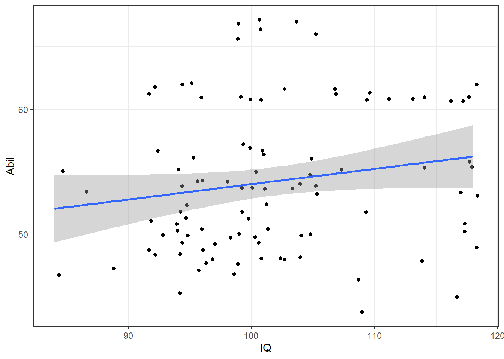
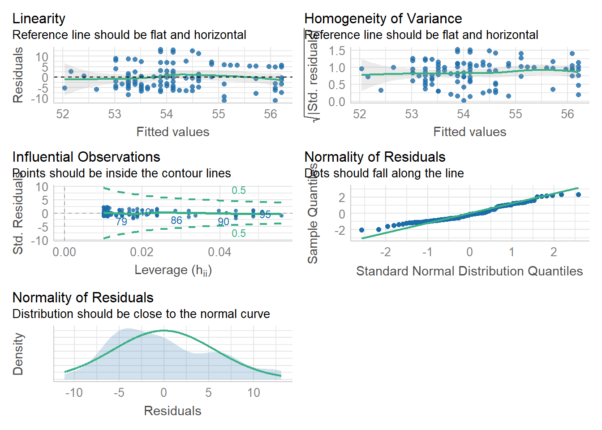

# Session 4.1 {#session-4-1}


In this chapter we will use a simulated version of a dataset adapted from [Miller and Haden (2013)](https://drive.google.com/file/d/0B1fyuTuvj3YoaFdUR3FZaXNuNXc/view){target="_blank"}, Chapter 11, looking at the relationship between four variables: reading ability, intelligence (IQ), the number of minutes per week spent reading at home (Home); and the number of minutes per week spent watching TV at home (TV). 

## Set-up

Open your Workshop project and do the following:

* Create and save a new R Markdown document named Session 4.1. get rid of the default template text from line 11 onwards.
* Load the required packages and data as below.


```r
library(patchwork)
library(correlation)
library(psych)
library(performance)
library(tidyverse)
mh <- read_csv("https://raw.githubusercontent.com/PsyTeachR/quant-fun-v2/main/book/data/chpt9/MillerHadenData.csv")
```


## Look at the data {#corr-a2}

If you have loaded in the data correctly then you should be able to have a look at it through one of the various methods we have looked at already.

* Look at your data using the `head()` function and you should see the following:

<div class="kable-table">

<table>
 <thead>
  <tr>
   <th style="text-align:right;"> Participant </th>
   <th style="text-align:right;"> Abil </th>
   <th style="text-align:right;"> IQ </th>
   <th style="text-align:right;"> Home </th>
   <th style="text-align:right;"> TV </th>
  </tr>
 </thead>
<tbody>
  <tr>
   <td style="text-align:right;"> 75 </td>
   <td style="text-align:right;"> 47 </td>
   <td style="text-align:right;"> 84 </td>
   <td style="text-align:right;"> 103 </td>
   <td style="text-align:right;"> 643 </td>
  </tr>
  <tr>
   <td style="text-align:right;"> 24 </td>
   <td style="text-align:right;"> 55 </td>
   <td style="text-align:right;"> 85 </td>
   <td style="text-align:right;"> 93 </td>
   <td style="text-align:right;"> 717 </td>
  </tr>
  <tr>
   <td style="text-align:right;"> 53 </td>
   <td style="text-align:right;"> 53 </td>
   <td style="text-align:right;"> 87 </td>
   <td style="text-align:right;"> 102 </td>
   <td style="text-align:right;"> 675 </td>
  </tr>
  <tr>
   <td style="text-align:right;"> 71 </td>
   <td style="text-align:right;"> 47 </td>
   <td style="text-align:right;"> 89 </td>
   <td style="text-align:right;"> 97 </td>
   <td style="text-align:right;"> 640 </td>
  </tr>
  <tr>
   <td style="text-align:right;"> 80 </td>
   <td style="text-align:right;"> 48 </td>
   <td style="text-align:right;"> 92 </td>
   <td style="text-align:right;"> 97 </td>
   <td style="text-align:right;"> 608 </td>
  </tr>
  <tr>
   <td style="text-align:right;"> 23 </td>
   <td style="text-align:right;"> 49 </td>
   <td style="text-align:right;"> 92 </td>
   <td style="text-align:right;"> 123 </td>
   <td style="text-align:right;"> 407 </td>
  </tr>
</tbody>
</table>

</div>

As you can see, we have five columns and they are: 

* the participant number (`Participant`), 
* Reading Ability score (`Abil`), 
* Intelligence score (`IQ`), 
* the number of minutes spent reading at Home per week (`Home`), 
* and the number of minutes spent watching TV per week (`TV`). 

Here we will we will focus on Reading Ability and IQ but for further practice you can look at other relationships in the optional exercises.  

A probable <a class='glossary' target='_blank' title='A proposed explanation made on the basis of limited evidence as a starting point for further investigation.' href='https://psyteachr.github.io/glossary/h#hypothesis'>hypothesis</a> is that as Intelligence predicts Reading Ability and we'll test this by performing a correlation then linear regression 

## Descriptive statistics and visualisation

First, we'll computer descriptive statistics for our variables of interest using `summarise()` as we've done previously.


```r
descriptives <- summarise(mh, 
                          Abil_mean = mean(Abil),
                          Abil_SD = sd(Abil),
                          IQ_mean = mean(IQ),
                          IQ_SD = sd(IQ))

descriptives
```

<div class="kable-table">

<table>
 <thead>
  <tr>
   <th style="text-align:right;"> Abil_mean </th>
   <th style="text-align:right;"> Abil_SD </th>
   <th style="text-align:right;"> IQ_mean </th>
   <th style="text-align:right;"> IQ_SD </th>
  </tr>
 </thead>
<tbody>
  <tr>
   <td style="text-align:right;"> 54.21 </td>
   <td style="text-align:right;"> 5.808901 </td>
   <td style="text-align:right;"> 101.73 </td>
   <td style="text-align:right;"> 8.317992 </td>
  </tr>
</tbody>
</table>

</div>

We can also then plot the relationship between the two variables on a scatterplot using `ggplot()`. We'll use `geom_jiter()` rather than `geom_point()` as there as a fe overlaping scores.


```r
ggplot(mh, aes(x = IQ, y = Abil)) +
  geom_jitter() +
  geom_smooth(method = "lm")
```

```
## `geom_smooth()` using formula 'y ~ x'
```




## Correlation

There's actually a lot of different packages and functions that you can use to run correlations, we'll use the `correlation()` function from the `correlation` package. Remember that for help on any function you can type e.g., `?correlation` in the console window.  The `correlation()` function requires:

* The name of the data set you are using
* The name of the first variable you want to select for the correlation
* The name of the second variable you want to select for the correlation
* The type of correlation you want to run: e.g. `pearson`, `spearman`
* The type of NHST tail you want to run: e.g. `"less"`,`"greater"`, `"two.sided"`

In our case, we want to correlate IQ and Abil in the dataset `mh`, we're going to use a Pearson correlation, and because we have a directional hypothesis (IQ and Abil should be positively correlated), we'll use a one-sided test to increase power.


```r
correlation(data = mh, 
            select = "IQ", 
            select2 = "Abil",  
            method = "pearson", 
            alternative = "greater")
```

## Multiple Correlations

We're only going to focus on the relationship between two variables but if you want to conduct correlations between multiple variables in data set it's easy to do with the `correlation` package. 

The `pairs.panels())` function comes from the `psych` library and creates a matrix of scatterplots, with the histograms, and correlation coefficients which you can then use to give you an overview of all the relationships at the one time. So it is useful for checking assumptions in one place.

The code below:

* Takes the dataset `mh` and then;
* Uses `select()` to get rid of the `Participant` column and then;
* Pipes the remaining data into the `pairs.panels()` function
* The additional arguments:
  * `ellipses = FALSE` turns off the [correlation ellipses](https://analyse-it.com/docs/user-guide/multivariate/scatter-plot#:~:text=If%20the%20association%20is%20a,more%20the%20variables%20are%20uncorrelated.){target="_blank"}, 
  * `lm = TRUE` use a linear line of best fit, 
  * `method = "pearson", specifies a Pearson correlation.

There are additional arguments to adjust the plot `pairs.panel` creates that you can look up in the help documentation if you are interested.


```r
mh %>%
  select(-Participant) %>%
  pairs.panels(ellipses = FALSE, 
               lm = TRUE, 
               method = "pearson")
```


To perform multiple correlations in one go, we will again use the `correlation()` function but rather than specifying two variables to correlate, you can also provide a data frame that has multiple variables  and it will run all possible correlations between the variables. Similar to above, we want to remove the `Participant` column before we do this.   

* `method` controls which correlation is computed, the default is `pearson` but if you needed to run the non-parametric version you could change this to `spearman`.  
* `p_adjust` allows you to apply a correction for multiple comparisons to your correlation analysis.  
* Because you're running multiple correlations and some may be positive and some may be negative, there is no option to specify a one or two-tailed test.   


```r
corr_results <- mh %>%
  select(-Participant) %>%
  correlation(method = "pearson", 
              p_adjust = "bonferroni")

corr_results
```

<div class="kable-table">

<table>
 <thead>
  <tr>
   <th style="text-align:left;"> Parameter1 </th>
   <th style="text-align:left;"> Parameter2 </th>
   <th style="text-align:right;"> r </th>
   <th style="text-align:right;"> CI </th>
   <th style="text-align:right;"> CI_low </th>
   <th style="text-align:right;"> CI_high </th>
   <th style="text-align:right;"> t </th>
   <th style="text-align:right;"> df_error </th>
   <th style="text-align:right;"> p </th>
   <th style="text-align:left;"> Method </th>
   <th style="text-align:right;"> n_Obs </th>
  </tr>
 </thead>
<tbody>
  <tr>
   <td style="text-align:left;"> Abil </td>
   <td style="text-align:left;"> IQ </td>
   <td style="text-align:right;"> 0.1759520 </td>
   <td style="text-align:right;"> 0.95 </td>
   <td style="text-align:right;"> -0.0211988 </td>
   <td style="text-align:right;"> 0.3599308 </td>
   <td style="text-align:right;"> 1.7694413 </td>
   <td style="text-align:right;"> 98 </td>
   <td style="text-align:right;"> 0.4795853 </td>
   <td style="text-align:left;"> Pearson correlation </td>
   <td style="text-align:right;"> 100 </td>
  </tr>
  <tr>
   <td style="text-align:left;"> Abil </td>
   <td style="text-align:left;"> Home </td>
   <td style="text-align:right;"> 0.6483613 </td>
   <td style="text-align:right;"> 0.95 </td>
   <td style="text-align:right;"> 0.5178973 </td>
   <td style="text-align:right;"> 0.7493498 </td>
   <td style="text-align:right;"> 8.4305432 </td>
   <td style="text-align:right;"> 98 </td>
   <td style="text-align:right;"> 0.0000000 </td>
   <td style="text-align:left;"> Pearson correlation </td>
   <td style="text-align:right;"> 100 </td>
  </tr>
  <tr>
   <td style="text-align:left;"> Abil </td>
   <td style="text-align:left;"> TV </td>
   <td style="text-align:right;"> -0.2755665 </td>
   <td style="text-align:right;"> 0.95 </td>
   <td style="text-align:right;"> -0.4477496 </td>
   <td style="text-align:right;"> -0.0836776 </td>
   <td style="text-align:right;"> -2.8378453 </td>
   <td style="text-align:right;"> 98 </td>
   <td style="text-align:right;"> 0.0331248 </td>
   <td style="text-align:left;"> Pearson correlation </td>
   <td style="text-align:right;"> 100 </td>
  </tr>
  <tr>
   <td style="text-align:left;"> IQ </td>
   <td style="text-align:left;"> Home </td>
   <td style="text-align:right;"> 0.1657398 </td>
   <td style="text-align:right;"> 0.95 </td>
   <td style="text-align:right;"> -0.0317106 </td>
   <td style="text-align:right;"> 0.3507398 </td>
   <td style="text-align:right;"> 1.6637510 </td>
   <td style="text-align:right;"> 98 </td>
   <td style="text-align:right;"> 0.5961413 </td>
   <td style="text-align:left;"> Pearson correlation </td>
   <td style="text-align:right;"> 100 </td>
  </tr>
  <tr>
   <td style="text-align:left;"> IQ </td>
   <td style="text-align:left;"> TV </td>
   <td style="text-align:right;"> 0.0332362 </td>
   <td style="text-align:right;"> 0.95 </td>
   <td style="text-align:right;"> -0.1642542 </td>
   <td style="text-align:right;"> 0.2281648 </td>
   <td style="text-align:right;"> 0.3292037 </td>
   <td style="text-align:right;"> 98 </td>
   <td style="text-align:right;"> 1.0000000 </td>
   <td style="text-align:left;"> Pearson correlation </td>
   <td style="text-align:right;"> 100 </td>
  </tr>
  <tr>
   <td style="text-align:left;"> Home </td>
   <td style="text-align:left;"> TV </td>
   <td style="text-align:right;"> -0.5716290 </td>
   <td style="text-align:right;"> 0.95 </td>
   <td style="text-align:right;"> -0.6905170 </td>
   <td style="text-align:right;"> -0.4226672 </td>
   <td style="text-align:right;"> -6.8967137 </td>
   <td style="text-align:right;"> 98 </td>
   <td style="text-align:right;"> 0.0000000 </td>
   <td style="text-align:left;"> Pearson correlation </td>
   <td style="text-align:right;"> 100 </td>
  </tr>
</tbody>
</table>

</div>

## Linear regression

To perform a linear regression is very simple using the function `lm()` (linear model). First you construct the model, then you use `summary()` to summarise the results.

* `~` is a tilde and in this context is probably most usefully translated as "by", i.e., predict Ability by IQ using the data in mh.


```r
mod <- lm(formula = Abil ~ IQ, data = mh)
summary(mod)
```

```
## 
## Call:
## lm(formula = Abil ~ IQ, data = mh)
## 
## Residuals:
##      Min       1Q   Median       3Q      Max 
## -11.1033  -4.4932  -0.6648   4.8215  13.1255 
## 
## Coefficients:
##             Estimate Std. Error t value Pr(>|t|)    
## (Intercept) 41.70975    7.08786   5.885 5.57e-08 ***
## IQ           0.12288    0.06944   1.769   0.0799 .  
## ---
## Signif. codes:  0 '***' 0.001 '**' 0.01 '*' 0.05 '.' 0.1 ' ' 1
## 
## Residual standard error: 5.747 on 98 degrees of freedom
## Multiple R-squared:  0.03096,	Adjusted R-squared:  0.02107 
## F-statistic: 3.131 on 1 and 98 DF,  p-value: 0.07993
```

## Assumptions

Finally, you can also check that your model meets the assumptions of linear regression using the `performance` package. This really is an excellent tool as it contains (amongst may other things), a handy wrapper function `check_model()` that performs all your assumption tests and provides clear and interpretable output:


```r
check_model(mod)
```



**If you get the error `Error in grid.Call(C_convert, x, as.integer(whatfrom), as.integer(whatto),  : Viewport has zero dimension(s)`, increase the size of the plot pane in RStudio (literally drag and make it bigger). **

## Multiple regression

If you want to add in additional predictors, you can do so by adjusting the formula:


```r
mod2 <- lm(formula = Abil ~ IQ + Home, data = mh) # no interaction
summary(mod2)

mod3 <- lm(formula = Abil ~ IQ * Home, data = mh) # with interaction between predictors
summary(mod3)
```

```
## 
## Call:
## lm(formula = Abil ~ IQ + Home, data = mh)
## 
## Residuals:
##     Min      1Q  Median      3Q     Max 
## -9.6274 -3.2104  0.0216  2.7649 14.5198 
## 
## Coefficients:
##             Estimate Std. Error t value Pr(>|t|)    
## (Intercept) 28.44312    5.72295   4.970 2.88e-06 ***
## IQ           0.04918    0.05451   0.902    0.369    
## Home         0.17180    0.02106   8.157 1.25e-12 ***
## ---
## Signif. codes:  0 '***' 0.001 '**' 0.01 '*' 0.05 '.' 0.1 ' ' 1
## 
## Residual standard error: 4.449 on 97 degrees of freedom
## Multiple R-squared:  0.4252,	Adjusted R-squared:  0.4133 
## F-statistic: 35.88 on 2 and 97 DF,  p-value: 2.171e-12
## 
## 
## Call:
## lm(formula = Abil ~ IQ * Home, data = mh)
## 
## Residuals:
##     Min      1Q  Median      3Q     Max 
## -8.2126 -3.1279 -0.2797  2.5575 14.5648 
## 
## Coefficients:
##              Estimate Std. Error t value Pr(>|t|)  
## (Intercept) 67.547054  28.274459   2.389   0.0189 *
## IQ          -0.333183   0.276187  -1.206   0.2306  
## Home        -0.151691   0.230066  -0.659   0.5113  
## IQ:Home      0.003156   0.002235   1.412   0.1612  
## ---
## Signif. codes:  0 '***' 0.001 '**' 0.01 '*' 0.05 '.' 0.1 ' ' 1
## 
## Residual standard error: 4.427 on 96 degrees of freedom
## Multiple R-squared:  0.4369,	Adjusted R-squared:  0.4193 
## F-statistic: 24.83 on 3 and 96 DF,  p-value: 5.633e-12
```

## Glossary {#glossary-regression}

<table class="table" style="margin-left: auto; margin-right: auto;">
 <thead>
  <tr>
   <th style="text-align:left;"> term </th>
   <th style="text-align:left;"> definition </th>
  </tr>
 </thead>
<tbody>
  <tr>
   <td style="text-align:left;"> [hypothesis](https://psyteachr.github.io/glossary/h.html#hypothesis){class="glossary" target="_blank"} </td>
   <td style="text-align:left;"> A proposed explanation made on the basis of limited evidence as a starting point for further investigation. </td>
  </tr>
</tbody>
</table>


## Further resources {#resources-regression}

* [Learning Statistical Models Through Simulation in R](https://psyteachr.github.io/stat-models-v1/)
* [Introduction to GLM](https://psyteachr.github.io/reprores-v2/glm.html)

