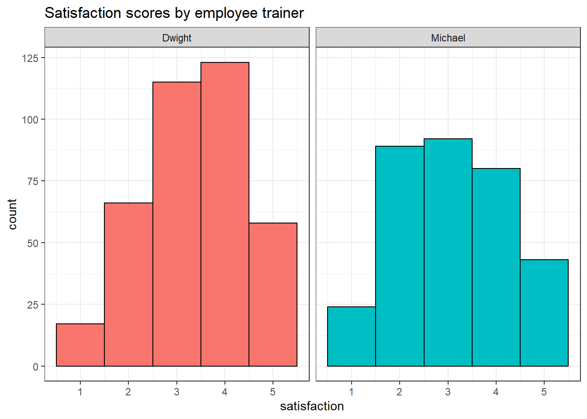
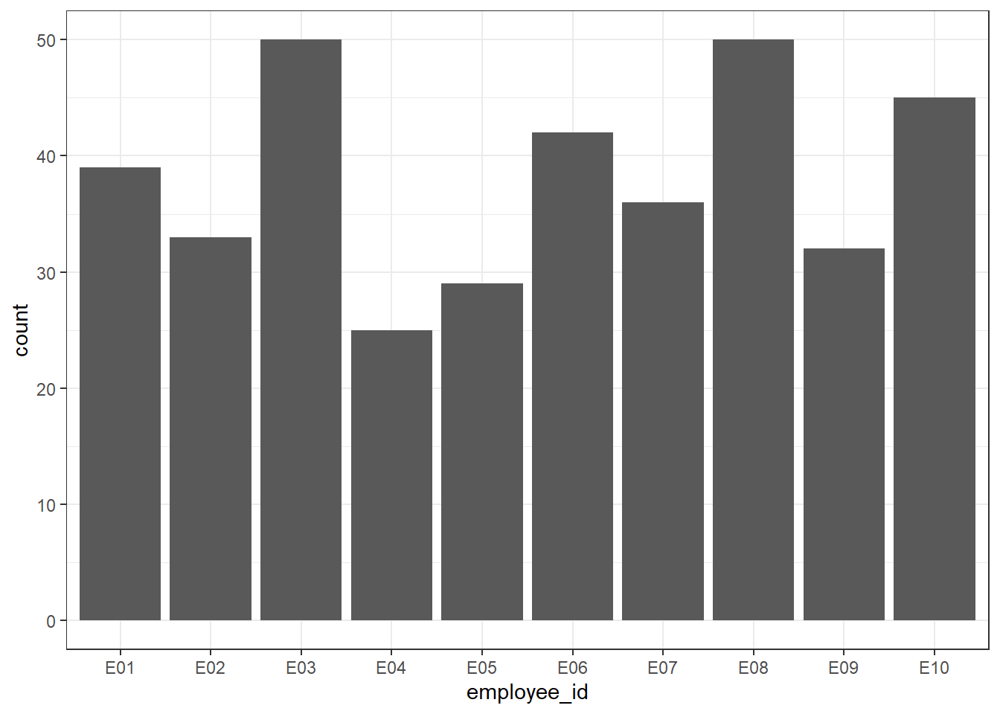

# Session 4.2 {#session-4-2}

## Test your understanding 1


::: {.try data-latex=""}
What are the resulting columns for these four examples?

* `budget %>% select(contains("_"))`
    <div class='webex-radiogroup' id='radio_DEAUKSKDWV'><label><input type="radio" autocomplete="off" name="radio_DEAUKSKDWV" value="x"></input> <span>sales_2019, sales_2020</span></label><label><input type="radio" autocomplete="off" name="radio_DEAUKSKDWV" value="x"></input> <span>sales_2020, expenses_2020, satisfaction_2020</span></label><label><input type="radio" autocomplete="off" name="radio_DEAUKSKDWV" value="answer"></input> <span>sales_2019, sales_2020, expenses_2019, expenses_2020, satisfaction_2019, satisfaction_2020</span></label><label><input type="radio" autocomplete="off" name="radio_DEAUKSKDWV" value="x"></input> <span>expenses_2019, expenses_2020</span></label></div>

* `budget %>% select(num_range("expenses_", 2019:2020))`
    <div class='webex-radiogroup' id='radio_BDXEKIUYMK'><label><input type="radio" autocomplete="off" name="radio_BDXEKIUYMK" value="x"></input> <span>sales_2019, sales_2020</span></label><label><input type="radio" autocomplete="off" name="radio_BDXEKIUYMK" value="x"></input> <span>sales_2020, expenses_2020, satisfaction_2020</span></label><label><input type="radio" autocomplete="off" name="radio_BDXEKIUYMK" value="x"></input> <span>sales_2019, sales_2020, expenses_2019, expenses_2020, satisfaction_2019, satisfaction_2020</span></label><label><input type="radio" autocomplete="off" name="radio_BDXEKIUYMK" value="answer"></input> <span>expenses_2019, expenses_2020</span></label></div>

* `budget %>% select(starts_with("sales"))`
    <div class='webex-radiogroup' id='radio_CYBPPZUGMZ'><label><input type="radio" autocomplete="off" name="radio_CYBPPZUGMZ" value="answer"></input> <span>sales_2019, sales_2020</span></label><label><input type="radio" autocomplete="off" name="radio_CYBPPZUGMZ" value="x"></input> <span>sales_2020, expenses_2020, satisfaction_2020</span></label><label><input type="radio" autocomplete="off" name="radio_CYBPPZUGMZ" value="x"></input> <span>sales_2019, sales_2020, expenses_2019, expenses_2020, satisfaction_2019, satisfaction_2020</span></label><label><input type="radio" autocomplete="off" name="radio_CYBPPZUGMZ" value="x"></input> <span>expenses_2019, expenses_2020</span></label></div>
 
* `budget %>% select(ends_with("2020"))`
    <div class='webex-radiogroup' id='radio_XNOHAVRTON'><label><input type="radio" autocomplete="off" name="radio_XNOHAVRTON" value="x"></input> <span>sales_2019, sales_2020</span></label><label><input type="radio" autocomplete="off" name="radio_XNOHAVRTON" value="answer"></input> <span>sales_2020, expenses_2020, satisfaction_2020</span></label><label><input type="radio" autocomplete="off" name="radio_XNOHAVRTON" value="x"></input> <span>sales_2019, sales_2020, expenses_2019, expenses_2020, satisfaction_2019, satisfaction_2020</span></label><label><input type="radio" autocomplete="off" name="radio_XNOHAVRTON" value="x"></input> <span>expenses_2019, expenses_2020</span></label></div>

:::


::: {.try data-latex=""}
Which IDs are kept from the table below?

<div class="kable-table">

<table>
 <thead>
  <tr>
   <th style="text-align:right;"> id </th>
   <th style="text-align:left;"> grade </th>
   <th style="text-align:right;"> score </th>
  </tr>
 </thead>
<tbody>
  <tr>
   <td style="text-align:right;"> 1 </td>
   <td style="text-align:left;"> A </td>
   <td style="text-align:right;"> 95 </td>
  </tr>
  <tr>
   <td style="text-align:right;"> 2 </td>
   <td style="text-align:left;"> A </td>
   <td style="text-align:right;"> 91 </td>
  </tr>
  <tr>
   <td style="text-align:right;"> 3 </td>
   <td style="text-align:left;"> C </td>
   <td style="text-align:right;"> 76 </td>
  </tr>
  <tr>
   <td style="text-align:right;"> 4 </td>
   <td style="text-align:left;"> B </td>
   <td style="text-align:right;"> 84 </td>
  </tr>
</tbody>
</table>

</div>

* `demo %>% filter(score < 80)`
    <select class='webex-select'><option value='blank'></option><option value='x'>1, 2</option><option value='x'>2</option><option value='answer'>3</option><option value='x'>3, 4</option></select>
* `demo %>% filter(grade == "A")`
    <select class='webex-select'><option value='blank'></option><option value='answer'>1, 2</option><option value='x'>2</option><option value='x'>3</option><option value='x'>3, 4</option></select>
* `demo %>% filter(grade != "A")`
    <select class='webex-select'><option value='blank'></option><option value='x'>1, 2</option><option value='x'>2</option><option value='x'>3</option><option value='answer'>3, 4</option></select>
* `demo %>% filter(score == 91)`
    <select class='webex-select'><option value='blank'></option><option value='x'>1, 2</option><option value='answer'>2</option><option value='x'>3</option><option value='x'>3, 4</option></select>
    

:::

::: {.try data-latex=""}
How would you find out the maximum sales for each region?

<div class='webex-radiogroup' id='radio_RMNLCAZETY'><label><input type="radio" autocomplete="off" name="radio_RMNLCAZETY" value="x"></input> <span><pre>budget3 %>%
  group_by(region) %>%
  summarise(max_sales = max(region)</pre></span></label><label><input type="radio" autocomplete="off" name="radio_RMNLCAZETY" value="answer"></input> <span><pre>budget3 %>%
  group_by(region) %>%
  summarise(max_sales = max(sales)</pre></span></label><label><input type="radio" autocomplete="off" name="radio_RMNLCAZETY" value="x"></input> <span><pre>budget3 %>%
  group_by(sales) %>%
  summarise(max_sales = max(sales)</pre></span></label><label><input type="radio" autocomplete="off" name="radio_RMNLCAZETY" value="x"></input> <span><pre>budget3 %>%
  group_by(sales) %>%
  summarise(max_sales = max(region)</pre></span></label></div>

:::

## Exercises 1

Let's try some exercises using a simulated dataset from a call centre that notes how long each caller waited for their call to be answered, how long the call then lasted, the issue they were calling about, the employee who answered their call, and their resulting customer satisfaction. Some of these will really push you so don't worry if you have to look at some of the solutions or hints.


```r
# from https://www.kaggle.com/kyanyoga/sample-sales-data
library(tidyverse)
survey_data <- read_csv("https://psyteachr.github.io/ads-v1/data/survey_data.csv")
```

```
## Rows: 707 Columns: 7
## -- Column specification --------------------------------------------------------
## Delimiter: ","
## chr  (3): caller_id, employee_id, issue_category
## dbl  (3): wait_time, call_time, satisfaction
## dttm (1): call_start
## 
## i Use `spec()` to retrieve the full column specification for this data.
## i Specify the column types or set `show_col_types = FALSE` to quiet this message.
```

### Creating new categories

Employees 1-5 were trained by Michael and employees 6-10 were trained by Dwight. 

* Create a new column named `trainer` that lists the trainer for each employee.
* Then, calculate the average satisfaction scores for employees trained by each trainer and visualise the satisfaction scores for each in whatever way you think best.

` r hide("Hint")`
To add the trainer column you can use `case_when()` and specify multiple criteria (e.g., if the employee is 1-5, Michael, if the employee is 6-10 Dwight).
` r unhide()`


<div class='webex-solution'><button>Solution</button>

```r
# case_when() method
survey_data <- survey_data %>%
  mutate(trainer = case_when(employee_id %in% c("E01", "E02", "E03", "E04", "E05") ~ "Michael",
                             employee_id %in% c("E06", "E07", "E08", "E09", "E10") ~ "Dwight"))

# mean satisfaction scores
survey_data %>%
  group_by(trainer) %>%
  summarise(mean_satisfaction = mean(satisfaction))

# possible visualisation 

ggplot(survey_data, aes(x = satisfaction, fill = trainer)) +
  geom_histogram(binwidth = 1, show.legend = FALSE, colour = "black") +
  facet_wrap(~trainer) +
  labs(title = "Satisfaction scores by employee trainer")
```

<div class="kable-table">

<table>
 <thead>
  <tr>
   <th style="text-align:left;"> trainer </th>
   <th style="text-align:right;"> mean_satisfaction </th>
  </tr>
 </thead>
<tbody>
  <tr>
   <td style="text-align:left;"> Dwight </td>
   <td style="text-align:right;"> 3.366755 </td>
  </tr>
  <tr>
   <td style="text-align:left;"> Michael </td>
   <td style="text-align:right;"> 3.088415 </td>
  </tr>
</tbody>
</table>

</div>
</div>

### Filter by calculated score

First, calculate the average wait time and then create a dataset named `long_wait` that just contains data from customers who waited more than the average wait time.


<div class='webex-solution'><button>Solution</button>

```r
survey_data %>%
  summarise(mean = mean(wait_time))

long_wait <- survey_data %>%
  filter(wait_time > 187)
```

<div class="kable-table">

<table>
 <thead>
  <tr>
   <th style="text-align:right;"> mean </th>
  </tr>
 </thead>
<tbody>
  <tr>
   <td style="text-align:right;"> 186.5955 </td>
  </tr>
</tbody>
</table>

</div>
</div>

Create a visualisation that shows how many customers waited more than the average wait time for each employee.


<div class='webex-solution'><button>Solution</button>

```r
long_wait %>%
  ggplot(aes(x = employee_id)) +
  geom_bar()
```


</div>


## Exercises 2

There's lots of different use cases for the `****_join()` functions. These exercises will allow you to practice different joins. If you have any examples of where joins might be helpful in your own work, please post them on Teams in the week 6 channel, as having many concrete examples can help distinguish between the different joins.

### Grade data

The University of Glasgow's Schedule A grading scheme uses a 22-point alphanumeric scale (there's more information in your summative report [assessment information sheet](https://sway.office.com/k0CnXGd6RjbVokkR){target="_blank"}). Each alphanumeric grade (e.g., B2) has an underlying numeric Grade Point (e.g., 16). 

Often when we're working with student grades they are provided to us in only one of these forms, but we need to be able to go between the two. For example, we need the numeric form in order to be able to calculate descriptive statistics about the mean grade, but we need the alphanumeric form to release to student records.

* Download <a href="data/grade_data1.csv" download>grade_data.csv</a>, <a href="data/grade_data2.csv" download>grade_data2.csv</a> and <a href="data/scheduleA.csv" download>scheduleA.csv</a> into your data folder.

* Read in `scheduleA.csv` and save it to an object named `schedule`.
* Read in `grade_data1.csv` and save it to an object named `grades1`.
* Read in `grade_data2.csv` and save it to an object named `grades2`.


<div class='webex-solution'><button>Solution</button>

```r
schedule <- read_csv("data/scheduleA.csv")
grades1 <- read_csv("data/grade_data1.csv") 
grades2 <- read_csv("data/grade_data2.csv")
```


</div>


### Matching the variable types

At UofG, all students are given a GUID, a numeric ID number. However, that ID number is also then combined with the first letter from your surname to create your username that is used with your email address. For example, if your ID is 1234567 and your surname is Nordmann, your username would be 1234567n. From a data wrangling perspective this is very annoying because the numeric ID will be stored as numeric data, but the username will be stored as character because of the letter at the end. `grades1` has a numeric id whilst `grades2` has the additional letter. In order to join these datasets, we need to standardise the variables.

First, remove the letter character from `id` using the function `stringr::str_replace_all()`, which replaces text that matches a pattern. Here, we're using the pattern `"[a-z]"`, which matches all lowercase letters a through z, and replacing them with `""`. See the help for `?about_search_regex` for more info about how to set patterns (these can get really complex).


```r
grades1 <- grades1 %>%
  mutate(id = str_replace_all(
    id, # the variable you want to search
    pattern = "[a-z]", # find all letters a-z
    replacement = "" # replace with nothing
  ))  
```


Now, transform the data type of `id` so that it matches the data type in `grades2`.


<div class='webex-solution'><button>Solution</button>

```r
# check variable types
glimpse(grades1)
glimpse(grades2) 

grades1 <- grades1 %>%
  mutate(id = as.numeric(id))
```


</div>


### Complete records

In this example, we want to join the grade data to schedule A so that each student with a grade has both the grade and the grade point. But we also want a complete record of all students on the course, so students with missing grades should still be included in the data.

* Join `grades1` and `scheduleA` and store this table in an object named `exam_all`.
* Do the same for `grades2` and save it in `essay_all`.
* Both `exam_all` and `essay_all` should have 100 observations of 4 variables.


<div class='webex-solution'><button>Hint</button>


You want to keep all of the data from `grade_data1` and `grade_data2`, but you only want the alphanumeric grades from `schedule` for the Grade Point values that exist in `grades`. E.g., if no-one was awarded an F1, your final dataset shouldn't have that in it.


</div>


<div class='webex-solution'><button>Solution</button>

```r
exam_all <- left_join(grades1, schedule, by = "Points")
essay_all <- left_join(grades2, schedule, by = "Points")
```


</div>


### Missing data

Alternatively, you may wish to have a dataset that only contains data for students who submitted each assessment and have a grade. First, run `summary()` on both `exam_all` and `essay_all`. 

* How many exam grades are missing? <input class='webex-solveme nospaces' size='2' data-answer='["17"]'/>
* How many essay grades are missing? <input class='webex-solveme nospaces' size='2' data-answer='["23"]'/>

Now, create an object `exam_grades` that joins together `grades1` and `schedule`, but this time the resulting object should only contain data from students who have a grade. Do the same but for `grades2` and store it in `essay_grades`.

Before you do this, given what you know about how many data points are missing in each data set:

* How many observations should `exam_grades` have? <input class='webex-solveme nospaces' size='2' data-answer='["83"]'/>
* How many observations should `essay_grades` have? <input class='webex-solveme nospaces' size='2' data-answer='["77"]'/>


<div class='webex-solution'><button>Solution</button>

```r
exam_grades <- inner_join(grades1, schedule, by = "Points")
essay_grades <- inner_join(grades2, schedule, by = "Points")
```


</div>


<div class='webex-solution'><button>Alternative solution</button>


It's worth noting that in reality you wouldn't actually go back to the raw data and do another join to get this dataset, you could just remove all the missing response by adding `%>% drop_na()` to `exam_all` and `essay_all`. However, for the purposes of teaching joins, we'll do it this slightly artificial way.


</div>


Now, create a dataset `completes` that joins the grades for students who have a grade for **both** the essay and the exam.  

* Because both `exam_grades` and `essay_grades` have the variables `Assessment`, `Points` and `Grades` that are named the same, but have different data, you should amend the suffix so that the resulting variables are named `Points_exam` and `Points_essay` etc. You may need to consult the help documentation to see an example to figure this out. 
* Clean up the file with `select()` and only keep the variables `id`, `Grade_exam`, and `Grade_essay`


<div class='webex-solution'><button>Solution</button>

```r
completes <- inner_join(exam_grades, essay_grades, 
                        by = "id", 
                        suffix = c("_exam", "_essay")) %>%
  select(id, Grade_exam, Grade_essay)
```


</div>

* How many students have a grade for both the exam and the essay? <input class='webex-solveme nospaces' size='2' data-answer='["62"]'/>

Now create a dataset `no_essay` that contains students that have a grade for the exam, but not the essay.


<div class='webex-solution'><button>Solution</button>

```r
no_essay <- anti_join(exam_grades, essay_grades, by = "id")
```


</div>

-   How many students have a grade for the exam but not the essay? <input class='webex-solveme nospaces' size='2' data-answer='["21"]'/>


Finally, now make a dataset `no_exam` that contains students have have a grade for the essay but not the exam


<div class='webex-solution'><button>Solution</button>

```r
no_exam <- anti_join(essay_grades, exam_grades, by = "id")
```


</div>

-   How many students have a grade for the exam but not the essay? <input class='webex-solveme nospaces' size='2' data-answer='["15"]'/>
